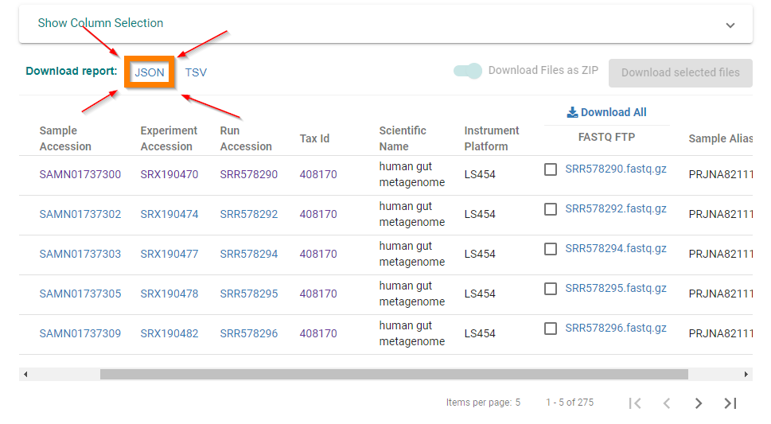
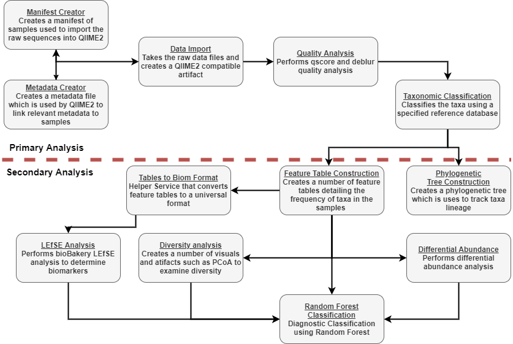

# Reproducible Analysis Pipeline for Microbiome Research 
This project provides the necessary code to implement a reproducible analysis pipleine for microbiome rearch which uses
Qiime2 tools to perform microbiome analysis.

## Prerequisites
You must have docker installed locally on your system in order to use this pipeline you can download docker at 
https://www.docker.com/.

## Deployment Instructions
In order to deploy this pipeline first clone the github repository.
Then navigate to the root folder of the project

### Sample Downloading and metadata entry
To download the samples you  must run a separate set of containers which download the samples from the ENA and add them
to the database as needed.

This can be done by navigating to the Dataingest folder and running the command `docker-compose up` this will then download
the samples based on the file report.json file.

This file is created by navigating to the ENA and downloading the summary table including the sample alias. As shown in 
the image. This table is available at https://www.ebi.ac.uk/ena/browser/view/PRJNA82111.

Additionaly this process will also store the metadata of the samples into the database. This data is read from the 
osccar_prism_metadata.txt file which was retrieved from http://huttenhower.sph.harvard.edu/ibd2012 but is provided in this repo.

### Silva 111
To run the architecture to get results using the Silva 111 Reference database simply run the `silva111.sh` file. This will
run a series of docker commands first building all of the containers and then running each one in order. The docker 
containers are all built using the docker-compose build command whilst also selecting the relevant .env file.
Docker wait is heavily utelised to ensure each container waits until its parent completes before attempting to execute

### Silva 138
To run the Silva 138 workflow do the same as above but using the `silva138.sh` file.
This will produce a number of result files in the PipelineOutput directory under the subdirectory MorganDataExperiments.

All qiime2 files `.qza` and `.qzv` can be viewed at https://view.qiime2.org/.

## Available Analysis Services
A summary of the currently available services can be seen in this image

Details of these services and their possible parameters can allso be seen by querying the database of consulting the 
`services_defs.json` file in the `mongoservice\db_init` directory

## Adding new services or changing the parameters
In order to add new services the services must be added to the `services_defs.json` file and the service must be corretly
defined in the docker compose file. This should be easy enough if you follow for format of the other containers.
This is also true for the implementation of your service. Much of each service is a boilerplate flow see image for example.

To change the parameters of the preexisitng services simply deteremine the parameters you wish to change and edit the 
relevant .env file where appropriate. You could also define your own docker-compose and .env file for custom workflows.

## Accessing the database
The database is implemented using a mongodb and as such you can connect to the database container using any mongodb 
connection methed that is compatiable with docker.

You can also connect to the DB by attaching a bash to the docker container while it is running, the using the command
`mongo` you can get access to the mongo db shell. All data is stored in the "metagenomic" database which can be selected
with the command `use metagenomic`.

# Additional
Service monitoring noted in the write up for this project was performed using CAdvisor and Prometheus these containers
were added to the docker compose file and were accessed using there web based uis. The service definitions for these
are included in the additional folder under `ResourceMonitor`
For any futher questions email billy.brookes.thornton@gmail.com
